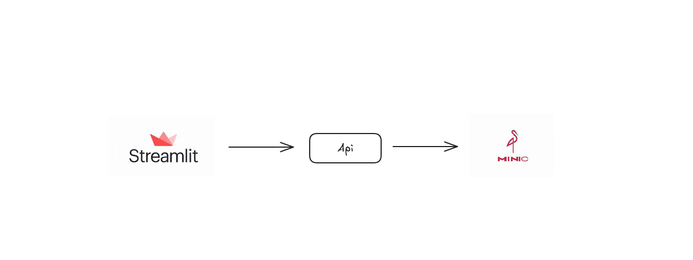

## Api de busca de notas fiscais



### Primeiro, clone o repositório
```
git clone https://github.com/vinifranco48/nfe.git
```
### Em seguida, entre na pasta docker
```
cd docker
```

### Construa a imagem utilizando o docker-compose

```
docker-compose up --build
```
